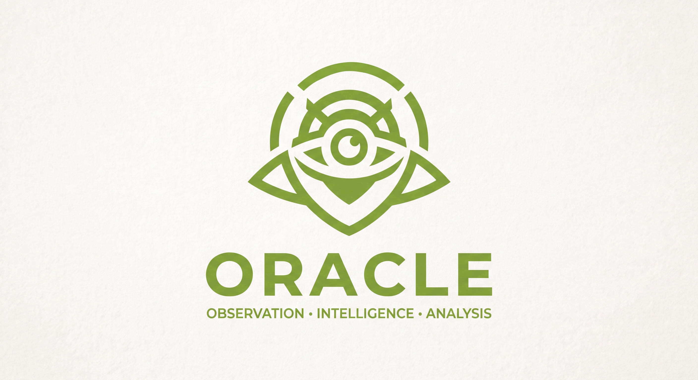

<p align="center">
  
</p>

<h1 align="center">ORACLE</h1>

<p align="center"><strong>PERSONAL OPSEC INTELLIGENCE ENGINE</strong></p>

<p align="center"><em>OBSERVATION · INTELLIGENCE · ANALYSIS</em></p>

<p align="center"><em>Visibility is not the same as understanding.</em></p>

<p align="center">
  
  
  
  
  
  
  
  
  
  
  
</p>

<p align="center">
  <a href="https://github.com/shwdaniel7/ORACLE"></a>
  <a href="https://github.com/shwdaniel7/ORACLE"></a>
  <a href="https://github.com/shwdaniel7/ORACLE"></a>
</p>

<p align="center"><sub><em>made by daniel • @shwdaniel7</em></sub></p>

---

## ⚠ Warning

ORACLE is a personal OPSEC (Operational Security) assessment tool. It evaluates how much of a digital identity is publicly discoverable, how apparently unrelated pieces of information can be correlated, and how that exposure can be reduced.

- Use ORACLE **only on your own digital footprint** or on information you are authorized to assess.
- It is not designed for profiling, targeting, or mass data collection about other people.
- A finding of `NOT_FOUND` never means something does not exist — it only means it was not observed.

---

## 📖 About

ORACLE approaches OPSEC as an **investigation problem**.

Modern digital identities are rarely contained within a single platform. A person may reuse the same username across many sites, reuse profile pictures, expose an email address in public repositories, leave metadata in uploaded files, or keep old accounts they no longer remember. Individually these pieces may seem harmless; together they can build a detailed picture of a person.

> **Exposure is often created through correlation rather than through a single piece of information.**

ORACLE exists to make that exposure visible. Instead of assuming what is private or public, you perform an assessment against your own digital footprint and understand where identities overlap, what information is exposed, and what should be addressed first.

The core question behind ORACLE:

> **"What could someone learn about me from the information I have left exposed?"**

Everything is stored locally. **Collect less. Expose less. Explain more.**

---

## 📐 The Four Stages

```text
DISCOVER
    ↓
CORRELATE
    ↓
ASSESS
    ↓
REMEDIATE
```

| Stage | Purpose | Status |
|---|---|---|
| **Discover** | Identify publicly accessible information associated with your identifiers (usernames, emails, domains) through presence-only collectors. | ✅ Implemented |
| **Correlate** | Detect when the same identifier is observed across multiple sources and model it as an identity relationship, always with an explicit confidence level. | ✅ Implemented |
| **Assess** | Evaluate the OPSEC significance of each finding and produce an explainable exposure score. | ✅ Implemented |
| **Remediate** | Turn findings into an actionable, priority-ordered remediation plan. | ✅ Implemented |

All four stages are available from both the friendly dashboard and the command line.

---

## ✨ Capabilities

### Local case management

- create, list, show, and delete assessment cases, each representing one investigation
- register identifiers under a case: `username`, `email`, `domain`, `profile`, or `other`
- record findings with category, severity, confidence, description, evidence, and recommendation
- model identity correlations as relationships between identifiers, each with a confidence and supporting evidence

### Evidence-first findings

Every finding carries a structured context:

| Field | Meaning |
|---|---|
| `category` | What kind of exposure was observed |
| `severity` | `LOW` · `MEDIUM` · `HIGH` · `CRITICAL` |
| `confidence` | `CONFIRMED` · `POSSIBLE` · `INFERRED` · `NOT_FOUND` |
| `description` | What was observed |
| `evidence` | Where it was observed, with a source and optional URL |
| `recommendation` | A suggested action |

Uncertainty is never hidden. `NOT_FOUND` is explicitly not the same as "does not exist".

### Presence-only discovery

ORACLE probes identifiers against public sources and records only what it actually observes — never guesses. Each collector is modular, rate-aware, and bounded:

| Collector | Identifier | Source |
|---|---|---|
| `github` | username | `api.github.com/users/{name}` (falls back to the public profile page when the API is rate-limited) |
| `gitlab` | username | `gitlab.com/api/v4/users?username=` |
| `reddit` | username | `reddit.com/user/{name}/about.json` |
| `dns` | domain | system resolver (A/AAAA records) |
| `crt` | domain | `crt.sh` certificate transparency |
| `gravatar` | email | `gravatar.com/{md5(email)}.json` |
| `pwnedpass` | password | `api.pwnedpasswords.com/range/{sha1-prefix}` |

Probing is **bounded**: a limit of probes per identity, a delay between requests, and per-source collection. A failed or inconclusive probe never becomes a finding — `NOT_FOUND` and `UNKNOWN` simply produce no evidence.

Emails are matched to a public Gravatar profile only when one actually exists; an email with no profile simply reports `not observed`. In the GUI, discovery **runs automatically** when you reach the *Descoberta* step, and the summary distinguishes `found` from `not observed` from `source error/rate-limited` — so a rate-limited source never reads as a false "not found".

Passwords are never stored or transmitted: the password is hashed (SHA-1) on your machine and only the **first 5 hex characters** reach the Pwned Passwords API (k-anonymity); the full comparison happens locally, so neither the password nor its complete hash ever leaves the computer. Breached passwords surface as `FOUND` findings with the exposure count.

### Automatic identity correlation

When the same username is observed on **two or more** sources, ORACLE creates a `same_username` relationship and a `Profile` identity for it, backed by the actual evidence collected. Re-running an assessment never duplicates correlations.

### Explainable OPSEC scoring

The assessment engine computes a transparent 0–100 score per dimension:

```text
Identity Separation
Username Hygiene
Email Exposure
Metadata Hygiene
Account Privacy
Public Information
Correlation Risk
```

Every score is derived from the findings that contributed to it, so the result is never an unexplained number.

### Remediation plans

Findings are grouped into a `HIGH` / `MEDIUM` / `LOW` priority plan of actionable recommendations, ready to be executed and re-assessed later.

### Structured reports

Assessments are exported as **JSON** (full structured data) or **Markdown** (readable audit), including executive summary, identity overview, exposure findings, correlations, scores, and remediation plan.

### Friendly dashboard

Run `oracle` with no arguments (or `oracle dashboard`) to open the desktop interface — no CLI needed for day-to-day use. The dashboard guides you step by step:

1. **New case** — name your assessment
2. **Identities** — add the usernames, emails, and domains you want to evaluate
3. **Discovery** — choose which public sources to probe (all are checked by default)
4. **Review** — inspect findings and evidence before accepting them
5. **Result** — see the exposure report and OPSEC score
6. **Remediation** — review the priority-ordered action plan and export JSON/Markdown reports

### Privacy-oriented design

ORACLE replaces assumption with observation: public-source probing is **presence-only**, bounded, and optional — you choose the sources in the dashboard. Everything is stored inside a local SQLite database under `~/.oracle/`, no data ever leaves your machine except the probes you authorize. Report files warn about sensitive data, and future phases add EXIF removal, metadata sanitization, report encryption, and secure deletion.

---

## 📂 Project Structure

```
ORACLE/
├── LICENSE
├── README.md
├── pyproject.toml
├── assets/
│   └── logo.jpg
├── docs/
│   └── context/
│       └── ORACLE_PROJECT_CONTEXT.md
└── oracle/
    ├── __init__.py
    ├── __main__.py
    ├── __about__.py          # version
    ├── config.py            # TOML configuration loader
    ├── cli/                 # Click command-line interface
    │   └── main.py
    ├── gui/                 # CustomTkinter dashboard
    │   ├── app.py           #   → main window and routing
    │   ├── wizard.py        #   → guided new-assessment flow
    │   ├── theme.py         #   → olive green identity
    │   ├── theme.json
    │   └── views/           #   → cases + settings screens
    ├── models/              # Pydantic v2 domain models
    │   ├── case.py
    │   ├── evidence.py
    │   ├── finding.py
    │   ├── identity.py
    │   ├── relationship.py
    │   └── enums.py
    ├── database/            # SQLAlchemy persistence layer
    │   ├── engine.py
    │   ├── base.py
    │   └── orm_models.py
    ├── case/                # Local case management
    │   └── manager.py
    ├── collectors/          # Presence-only public information collectors
    │   ├── base.py          #   → BaseCollector contract + ProbeResult
    │   ├── http.py          #   → bounded HTTP client
    │   ├── registry.py      #   → probe planning + scan orchestration
    │   ├── mapper.py        #   → probe results to findings
    │   └── sources/         #   → github, gitlab, reddit, dns, crt, gravatar, pwnedpass
    ├── analyzers/           # Correlation analyzers
    │   ├── base.py          #   → BaseAnalyzer contract
    │   └── correlation.py   #   → same_username identity correlation
    ├── services/            # Engine layer
    │   └── engine.py        #   → AssessmentEngine (scan, analyze, assess)
    ├── opsec/               # Assessment engine
    │   ├── scoring.py
    │   └── recommendations.py
    ├── reports/             # Report generation
    │   └── generator.py
    └── tests/               # pytest suite
```

- `models/` holds the canonical Pydantic v2 data structures used everywhere.
- `database/` persists them with SQLAlchemy in a single local SQLite file.
- `case/manager.py` provides all CRUD operations for cases, identities, findings, and relationships.
- `collectors/` implements the discovery stage: modular sources probe identifiers only against evidence, and `registry.py` plans bounded scans with progress and cancellation.
- `analyzers/correlation.py` implements the correlation stage: the same identifier observed across multiple sources becomes a relationships.
- `services/engine.py` orchestrates the full pipeline — discovery → correlation → assessment → remediation — for both the CLI and the dashboard.
- `opsec/scoring.py` and `opsec/recommendations.py` implement the assessment and remediation stages.
- `reports/generator.py` renders JSON and Markdown assessments.
- `cli/main.py` binds everything behind the `oracle` command (and opens the dashboard when run without arguments).
- `gui/` is the CustomTkinter dashboard: it uses the same engine as the CLI, so nothing learned in the terminal is lost.

`docs/ORACLE_PROJECT_CONTEXT.md` is the full specification behind the project, including philosophy, architecture direction, visual identity, and roadmap.

---

## 🔄 Assessment Workflow

```text
oracle dashboard            → the friendly way (no CLI needed)
oracle scan <case-id>       → probe identifiers against public sources
       │
       ├─► github · gitlab · reddit · dns · crt
       │
       └─► findings with evidence (presence-only, bounded probes)

oracle analyze <case-id>    → detect cross-platform identity correlation
       │
       └─► same_username relationships (never duplicated)

oracle report <case-id>     → scoring + remediation plan
       │        │
       │        ├─► JSON assessment (full structured data)
       │        └─► Markdown assessment (readable audit)
       │
       └─► re-assess later → compare scores over time
```

The GUI wizard automates the same flow step by step; the CLI exists for scripting and transparency.

---

## 🚀 Installation

Requires **Python 3.10+**.

```bash
git clone https://github.com/shwdaniel7/ORACLE.git
cd ORACLE
pip install -e .
```

To also install the desktop dashboard:

```bash
pip install -e ".[gui]"
```

Command-line tool supported on Windows, macOS, and Linux. The dashboard requires a desktop environment (Windows and Linux/macOS with a display).

---

## 🔑 Configuration

ORACLE reads a TOML file from `~/.oracle/config.toml` (overridable with the `ORACLE_CONFIG` environment variable):

```toml
[storage]
data_dir = "C:/Users/you/.oracle"

[reports]
default_format = "markdown"

[collectors]
enabled = ["github", "gitlab", "reddit", "dns", "crt", "gravatar", "pwnedpass"]
timeout_seconds = 10
delay_seconds = 0.2
max_probes_per_identity = 8

[gui]
theme = "olive"
```

Run `oracle init` to create the configuration and local storage automatically.

| Environment variable | Purpose |
|---|---|
| `ORACLE_CONFIG` | Path to the configuration file |
| `ORACLE_DATA_DIR` | Directory for the local SQLite database |

---

## 💻 Usage

The fastest way is the dashboard:

```bash
oracle dashboard
# or simply: oracle
```

Prefer the terminal? The CLI mirrors the same pipeline:

```bash
oracle init
oracle case new "My First Audit"
oracle identity add <case-id> --type username --value "example_user"
oracle scan <case-id>                      # probe public sources for evidence
oracle analyze <case-id>                   # detect cross-platform correlation
oracle report <case-id> --format markdown  # scoring + remediation plan
```

### Command reference

```text
oracle                                              Open the dashboard (no CLI needed)
oracle init                                    Initialize configuration and local storage
oracle case new <name> [--description]         Create an assessment case
oracle case list                               List all cases
oracle case show <case-id>                     Show case details and contents
oracle case delete <case-id> [--force]         Delete a case and all of its data
oracle identity add <case-id> --type <t> --value <v> [--label <l>]
oracle identity list <case-id>                 List identities in a case
oracle finding add <case-id> --category <c> --severity <s> --confidence <c> --description <d>
                  [--recommendation <r>] [--source <src> --source-url <url>]
oracle finding list <case-id>                  List findings in a case
oracle relationship add <case-id> --from <id-a> --to <id-b> --type <t> --confidence <c> [--notes]
oracle relationship list <case-id>             List relationships in a case
oracle scan <case-id> [--collector <name>...]  Probe identifiers against public sources
                  [--no-save]
oracle analyze <case-id> [--no-save]           Detect identity correlations across sources
oracle report <case-id> --format json|markdown [--output <file>]
oracle version                                 Show the installed version
```

Run `oracle --help` for the full reference.

### Example interaction

```text
$ oracle version
ORACLE 0.2.0 — PERSONAL OPSEC INTELLIGENCE ENGINE

$ oracle case new "My Audit"

╭──────────────────────────────────────────────╮
│  Case created                                │
│  ID: 3de7ab8291004472bb92bff02be618b1        │
│  Name: My Audit                              │
╰──────────────────────────────────────────────╯
```

```text
$ oracle scan <case-id>

Scanning 1 identity against 7 collectors...

✓ github  → example_user  FOUND (github.com/example_user)
✓ gitlab  → example_user  FOUND (gitlab.com/example_user)
· reddit  → example_user  not observed
· dns     → example.com   not observed

1 new finding recorded with 1 evidence.
```

```text
$ oracle report <case-id> --format markdown
# ORACLE OPSEC ASSESSMENT

**PERSONAL OPSEC INTELLIGENCE ENGINE**

OBSERVATION · INTELLIGENCE · ANALYSIS

## Executive Summary

- **Case:** My Audit
- **Overall OPSEC Score:** 72 / 100

## Exposure Findings

### [HIGH · CONFIRMED] Identity Correlation

The same username is publicly associated with multiple identities.

**Evidence:**
- **github.com** (github.com)
- **reddit.com** (reddit.com)

**Recommendation:** Separate personal and public-facing identifiers.

## OPSEC Scores

| Dimension | Score |
|-----------|-------|
| Identity Separation | 58 |
| Username Hygiene | 41 |
| Correlation Risk | 55 |
| **Overall** | **72** |

## Remediation Plan

### HIGH PRIORITY

- [ ] Replace reused username on personal accounts
```

Reports can also be written to disk:

```bash
oracle report <case-id> --format json --output report.json
oracle report <case-id> --format markdown --output report.md
```

---

## 🧩 Architecture

### `oracle/models/`

Pydantic v2 domain models: `Case`, `Identity`, `Finding`, `Evidence`, and `Relationship`, plus the shared `Severity` and `Confidence` enums. These models are the single source of truth used by the CLI, the database, and the reports.

### `oracle/database/`

SQLAlchemy 2.0 persistence over a single local SQLite file. Case data is fully isolated per case, and any relationship or finding can carry supporting evidence.

### `oracle/case/manager.py`

The `CaseManager` is the core service: it creates cases, registers identities, stores findings with evidence, models relationships, and assembles a full assessment bundle for reporting. Every method works against the local database with no network access.

### `oracle/opsec/`

- `scoring.py` — maps findings to the seven assessment dimensions and produces an explainable 0–100 score. Confidence weights modulate the penalty of each finding (`CONFIRMED` full weight, `INFERRED`/`POSSIBLE` reduced, `NOT_FOUND` none).
- `recommendations.py` — converts findings into a `HIGH` / `MEDIUM` / `LOW` remediation plan.

### `oracle/reports/generator.py`

Renders an `AssessmentBundle` — case, identities, findings, relationships, scores, and remediation — into JSON (structured) or Markdown (readable). The Markdown report contains executive summary, identity overview, exposure findings with evidence, correlations, the OPSEC score table, and the remediation plan.

### `oracle/cli/main.py`

A Click group with Rich output styled in ORACLE's olive green. It exposes `init`, `case`, `identity`, `finding`, `relationship`, `scan`, `analyze`, `report`, `dashboard`, and `version` — and opens the dashboard automatically when invoked without arguments.

### `oracle/collectors/`

- `base.py` — `BaseCollector` contract (`name`, `reliability`, `supported_identifiers`, `probe()`), with `ProbeResult` (`FOUND` / `NOT_FOUND` / `UNKNOWN` / `ERROR`).
- `http.py` — a bounded `httpx` client with a timeout per request.
- `registry.py` — plans which collectors apply to which identifiers, runs scans with a delay between probes, and reports progress or cancellation.
- `mapper.py` — converts probe results into findings with evidence (`NOT_FOUND` and `UNKNOWN` are never promoted to findings).
- `sources/` — the individual collectors: GitHub, GitLab, Reddit, Gravatar (username/email), Pwned Passwords (password), DNS and crt.sh (domain).

Probing is deliberately conservative: it confirms presence only, and each probe carries the URL that served as evidence.

### `oracle/analyzers/correlation.py`

Implements the correlation stage: whenever the same username is observed on two or more sources, it creates a `Profile` identity and a `same_username` relationship with `CONFIRMED` confidence, backed by copies of the collected evidence.

### `oracle/services/engine.py`

`AssessmentEngine` is the single entry point shared by the CLI and the dashboard: `scan()` probes and persists findings, `analyze()` applies correlation idempotently (re-running never duplicates), and `run_assessment()` produces the full bundle for scoring and reporting.

### Contracts for future phases

- `analyzers/base.py` defines `BaseAnalyzer`, the contract for future analyzers beyond username correlation.

Future engines plug in without changing the CLI, the dashboard, or the models.

---

## 🔬 Technical Concepts

### Confidence, not certainty

Every finding and relationship carries an explicit confidence state:

```text
CONFIRMED    Observed with direct evidence
POSSIBLE     Plausible but not fully verified
INFERRED     Derived from context
NOT_FOUND    Not observed
```

ORACLE never turns a possibility into a fact merely because it looks plausible.

### Context before risk

A single public username is not automatically dangerous. ORACLE evaluates findings in context — the same username on a personal forum, combined with a personal email and location information, becomes a meaningful correlation. Findings are scored and prioritized together rather than treated as isolated facts.

### Explainable scoring

The overall score is the mean of the seven dimension scores, and each dimension is the sum of severity-weighted penalties from its contributing findings. No score exists without the findings behind it.

### Local first, data minimization

Analysis and storage are entirely local. ORACLE does not collect or retain information without a reason, and the user owns the investigation and its results.

---

## 🛣 Roadmap

```text
Phase 1 · Foundation             ✅  → CLI, config, cases, models, scoring, reporting
Phase 2 · Exposure Discovery     ✅  → GitHub, GitLab, Reddit, Gravatar, Pwned Passwords, DNS, crt.sh collectors
Phase 3 · Identity Correlation   ✅  → same_username correlation, relationship evidence
Phase 4 · OPSEC Assessment       ✅  → risk categories, finding prioritization
Phase 6 · Dashboard              ✅  → CustomTkinter GUI, guided wizard, settings
Phase 5 · Privacy Tools          🔭  → EXIF analysis, metadata sanitization, encrypted reports
Phase 7 · Historical Intelligence 🔭 → assessment history, exposure comparison, trends
Phase 8 · More collectors         🔭  → email-focused sources, profile aggregators
```

---

## 🤝 Relationship to CERBERUS

ORACLE and [CERBERUS](https://github.com/shwdaniel7/CERBERUS) are separate tools that share a common design philosophy:

```text
CERBERUS
    ↓
Looks inside the artifact.

ORACLE
    ↓
Looks outward at the identity.
```

| | CERBERUS | ORACLE |
|---|---|---|
| **Subtitle** | STATIC MALWARE ANALYSIS ENGINE | PERSONAL OPSEC INTELLIGENCE ENGINE |
| **Color** | Red | Olive Green |
| **Focus** | Files · Malware · Indicators · Static Analysis · Evidence | Identity · Exposure · Correlation · Privacy · OPSEC |

Both projects favor: **Evidence first. Context before conclusions.**

---

## 📚 Technologies

- Python 3.10+
- Click (command-line interface)
- Rich (terminal output)
- CustomTkinter (desktop dashboard; installed via the `gui` extra)
- httpx (bounded public-source probing)
- Pydantic v2 (domain models and validation)
- SQLAlchemy 2.0 (SQLite persistence)
- TOML (configuration)
- JSON / Markdown (report generation)

---

## ⚖ Legal Notice

ORACLE is a defensive, personal-security tool. It is intended for self-assessment of your own digital footprint and is designed around publicly accessible information, user-provided information, legitimate APIs, and local analysis.

ORACLE must not be used for credential theft, unauthorized account access, mass targeting of individuals, or covert surveillance.

The author assumes no responsibility for misuse. Use this project only on information you are permitted to assess.

---

## 📄 License

GNU General Public License v3.0 or later. See [LICENSE](LICENSE).